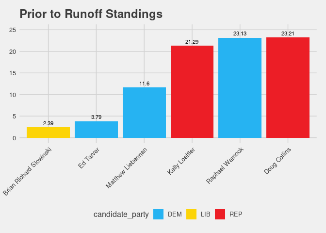
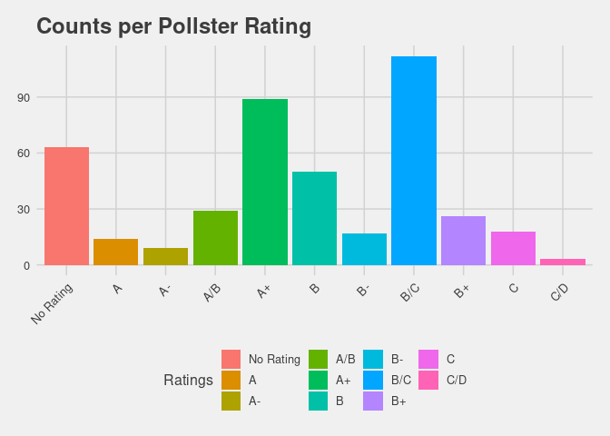
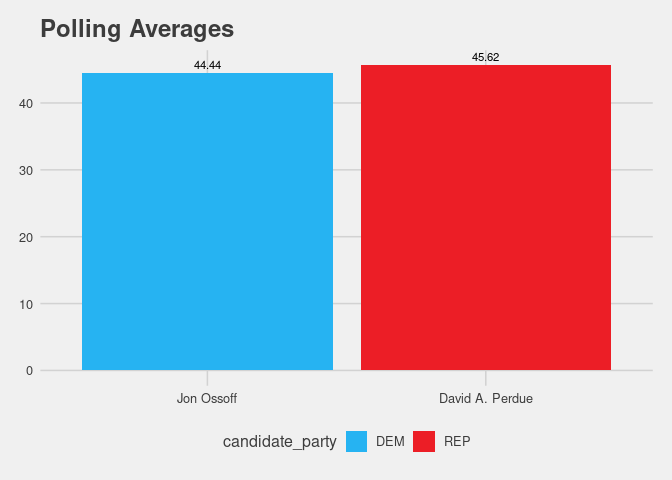

EDA
================

Start by reading in the senate polling data. I have this as a .cvs so it
will need to manually updated from time to time.

``` r
polls <- read.csv(here::here("Data" , "senate_polls.csv")) #loading data
polls <- georgia::initial_poll_cleaning(polls) #cleaning via the georgia package
```

# EDA

Even though I will be modeling the Ossoff vs Perdue race I thought it
might be insightful to see where the other Georgia Senate race stands.
The top two candidates are basically tied.

``` r
EDA_polls <- polls %>% 
  group_by(candidate_name, candidate_party) %>%
  summarise(average_polling = mean(pct)) %>%
  filter(candidate_name == "Raphael Warnock" | candidate_name == "Kelly Loeffler" | candidate_name == "Doug Collins" |
         candidate_name == "Matthew Lieberman" | candidate_name == "Ed Tarver" | candidate_name == "Brian Richard Slowinski")
```

    ## `summarise()` regrouping output by 'candidate_name' (override with `.groups` argument)

``` r
ggplot(EDA_polls, aes(reorder(candidate_name, average_polling), average_polling, fill = candidate_party, label = round(average_polling, 2))) +
  geom_bar(stat = "identity") +
  scale_fill_manual(values=c("#26b3f2", "#fcd407", "#ec1e26")) +
  theme_fivethirtyeight() +
  theme(axis.text.x = element_text(angle = 45, hjust=1)) +
  ggtitle("Prior to Runoff Standings") +
  ylab("Polling Average(percent)") +
  xlab("Candidate") +
  geom_text(position = position_dodge(width = .9),    # move to center of bars
              vjust = -.5,    # nudge above top of bar
              size = 3) +
  ylim(0, 25)
```

<!-- -->

Polling quality will be important when trying to make predictions. Below
I made a quick graph showing the fivethirtyeight ratings for every poll.
They take many things into consideration when rating the polls such as
sample size and partisan lean of a pollster. I will use this information
more in my analysis file `05_weighted sampling`.

``` r
EDA_polls_rating <- polls %>% 
  group_by(fte_grade) %>%
  count(fte_grade) %>%
  mutate(fte_grade = fct_recode(fte_grade, "No Rating" = ""))

ggplot(EDA_polls_rating, aes(fte_grade, n, fill = fte_grade)) +
  geom_bar(stat = "identity") +
  theme_fivethirtyeight() +
  theme(axis.text.x = element_text(angle = 45, hjust=1)) +
  ylab("Number of Polls Conducted") +
  xlab("Rating") +
  ggtitle("Counts per Pollster Rating") +
  labs(fill = "Ratings")
```

<!-- -->

Next up, I wanted to see where the polls currently stand for the Perdue
vs Ossoff race, so below I plotted the current polling averages.

``` r
Perdue_vs_Ossoff <- polls %>% 
  group_by(candidate_name, candidate_party, cycle) %>%
  mutate(standard_deviation = sd(pct)) %>%
  summarise(average_polling = mean(pct), standard_deviation = mean(standard_deviation)) %>%
  filter(candidate_name == "David A. Perdue" | candidate_name == "Jon Ossoff")
```

    ## `summarise()` regrouping output by 'candidate_name', 'candidate_party' (override with `.groups` argument)

``` r
Perdue_vs_Ossoff
```

    ## # A tibble: 2 x 5
    ## # Groups:   candidate_name, candidate_party [2]
    ##   candidate_name  candidate_party cycle average_polling standard_deviation
    ##   <fct>           <fct>           <int>           <dbl>              <dbl>
    ## 1 David A. Perdue REP              2020            45.6               2.39
    ## 2 Jon Ossoff      DEM              2020            44.4               2.99

``` r
ggplot(Perdue_vs_Ossoff, aes(reorder(candidate_name, average_polling), 
                             average_polling, 
                             fill = candidate_party, 
                             label = round(average_polling, 2))) +
  geom_bar(stat = "identity") +
  scale_fill_manual(values=c("#26b3f2", "#ec1e26")) +
  theme_fivethirtyeight() +
  ggtitle("Polling Averages") +
  ylab("Polling Average(percent)") +
  xlab("Candidate") +
  geom_text(position = position_dodge(width = .9),    # move to center of bars
              vjust = -.5,    # nudge above top of bar
             size = 3) 
```

<!-- -->

``` r
  ylim(0, 60)
```

    ## <ScaleContinuousPosition>
    ##  Range:  
    ##  Limits:    0 --   60

Lastly, I wanted to pull in some historical data to see how past
candidates performed in Georgia Senate elections. Mostly curious about
how well Republicans did compared to Democrats.

``` r
#bringing in old data

historical <- read.csv(here::here("data", "us_senate_elections.csv"))
historical <- historical %>%
  filter(state == "GA" |state == "Georgia") # just geogria

average_historical <- function(select_year){
  historical %>% 
  filter(year == select_year) %>%
  filter(office == "Senate") %>%
  group_by(candidate, year, party) %>%
  summarise(average_polling = mean(projected_voteshare), actutal_voteshare = mean(actual_voteshare),
            standard_deviation = mean(sd(projected_voteshare))) 
            #standard_deviation_actual = mean(sd(actual_voteshare)))
}

#Isakson vs Barksdale and Perdue vs Nunn
summary_table <- bind_rows(average_historical("2016"), average_historical("2014"))
```

    ## `summarise()` regrouping output by 'candidate', 'year' (override with `.groups` argument)
    ## `summarise()` regrouping output by 'candidate', 'year' (override with `.groups` argument)

``` r
summary_table <- summary_table %>%
  rename("candidate_party" = party) %>%
  rename("cycle" = year) %>%
  rename("candidate_name" = candidate)
```

``` r
total_data <- bind_rows(Perdue_vs_Ossoff, summary_table) %>%
  mutate(candidate_party = recode(candidate_party, 
                                  `REP` = "R", 
                                  `DEM` = "D")) %>%
  filter(candidate_party == "R" | candidate_party == "D") %>% #2020 election will not have independents, only top two advance
  group_by(cycle) %>%
  arrange(cycle, candidate_party) %>%
  mutate(spread = average_polling - lag(average_polling)) %>%
  fill(spread, .direction = "up") %>%
  mutate(spread = case_when(candidate_party == "R" ~ spread,
                            candidate_party == "D" ~ (-1 * spread))) #creating the spread for both candidates based on party. 
formattable(total_data)
```

<table class="table table-condensed">

<thead>

<tr>

<th style="text-align:right;">

candidate\_name

</th>

<th style="text-align:right;">

candidate\_party

</th>

<th style="text-align:right;">

cycle

</th>

<th style="text-align:right;">

average\_polling

</th>

<th style="text-align:right;">

standard\_deviation

</th>

<th style="text-align:right;">

actutal\_voteshare

</th>

<th style="text-align:right;">

spread

</th>

</tr>

</thead>

<tbody>

<tr>

<td style="text-align:right;">

Mary Michelle Nunn

</td>

<td style="text-align:right;">

D

</td>

<td style="text-align:right;">

2014

</td>

<td style="text-align:right;">

48.00265

</td>

<td style="text-align:right;">

0.2843994

</td>

<td style="text-align:right;">

45.21

</td>

<td style="text-align:right;">

\-1.125558

</td>

</tr>

<tr>

<td style="text-align:right;">

David A. Perdue

</td>

<td style="text-align:right;">

R

</td>

<td style="text-align:right;">

2014

</td>

<td style="text-align:right;">

49.12821

</td>

<td style="text-align:right;">

0.6324969

</td>

<td style="text-align:right;">

52.89

</td>

<td style="text-align:right;">

1.125558

</td>

</tr>

<tr>

<td style="text-align:right;">

Jim Barksdale

</td>

<td style="text-align:right;">

D

</td>

<td style="text-align:right;">

2016

</td>

<td style="text-align:right;">

41.16368

</td>

<td style="text-align:right;">

1.5583190

</td>

<td style="text-align:right;">

41.03

</td>

<td style="text-align:right;">

\-14.250457

</td>

</tr>

<tr>

<td style="text-align:right;">

Johnny Isakson

</td>

<td style="text-align:right;">

R

</td>

<td style="text-align:right;">

2016

</td>

<td style="text-align:right;">

55.41413

</td>

<td style="text-align:right;">

1.3682720

</td>

<td style="text-align:right;">

54.78

</td>

<td style="text-align:right;">

14.250457

</td>

</tr>

<tr>

<td style="text-align:right;">

Jon Ossoff

</td>

<td style="text-align:right;">

D

</td>

<td style="text-align:right;">

2020

</td>

<td style="text-align:right;">

44.43982

</td>

<td style="text-align:right;">

2.9885953

</td>

<td style="text-align:right;">

NA

</td>

<td style="text-align:right;">

\-1.177803

</td>

</tr>

<tr>

<td style="text-align:right;">

David A. Perdue

</td>

<td style="text-align:right;">

R

</td>

<td style="text-align:right;">

2020

</td>

<td style="text-align:right;">

45.61763

</td>

<td style="text-align:right;">

2.3892167

</td>

<td style="text-align:right;">

NA

</td>

<td style="text-align:right;">

1.177803

</td>

</tr>

</tbody>

</table>
