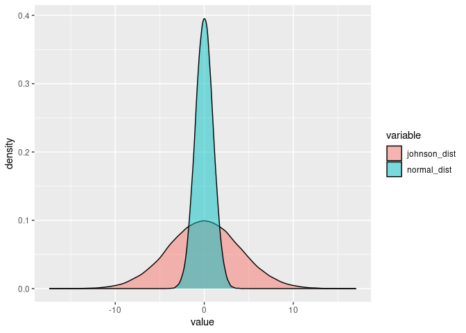

Johnson Distribution
================

``` r
polls <- read.csv(here::here("Data","senate_polls.csv"))
```

``` r
polls <- polls %>%
  filter(state == "Georgia") %>%
  filter(race_id == "7780" | race_id == "6271") %>%
  group_by(candidate_name)
polls
```

    ## # A tibble: 430 x 38
    ## # Groups:   candidate_name [25]
    ##    question_id poll_id cycle state pollster_id pollster sponsor_ids sponsors
    ##          <int>   <int> <int> <fct>       <int> <fct>    <fct>       <fct>   
    ##  1      135283   72146  2020 Geor…         320 Monmout… ""          ""      
    ##  2      135283   72146  2020 Geor…         320 Monmout… ""          ""      
    ##  3      135283   72146  2020 Geor…         320 Monmout… ""          ""      
    ##  4      135284   72146  2020 Geor…         320 Monmout… ""          ""      
    ##  5      135284   72146  2020 Geor…         320 Monmout… ""          ""      
    ##  6      135285   72146  2020 Geor…         320 Monmout… ""          ""      
    ##  7      135285   72146  2020 Geor…         320 Monmout… ""          ""      
    ##  8      135286   72146  2020 Geor…         320 Monmout… ""          ""      
    ##  9      135286   72146  2020 Geor…         320 Monmout… ""          ""      
    ## 10      135286   72146  2020 Geor…         320 Monmout… ""          ""      
    ## # … with 420 more rows, and 30 more variables: display_name <fct>,
    ## #   pollster_rating_id <int>, pollster_rating_name <fct>, fte_grade <fct>,
    ## #   sample_size <int>, population <fct>, population_full <fct>,
    ## #   methodology <fct>, office_type <fct>, seat_number <int>, seat_name <fct>,
    ## #   start_date <fct>, end_date <fct>, election_date <fct>,
    ## #   sponsor_candidate <fct>, internal <fct>, partisan <fct>, tracking <lgl>,
    ## #   nationwide_batch <fct>, ranked_choice_reallocated <fct>, created_at <fct>,
    ## #   notes <fct>, url <fct>, stage <fct>, race_id <int>, answer <fct>,
    ## #   candidate_id <int>, candidate_name <fct>, candidate_party <fct>, pct <dbl>

# Johnson vs Normal

``` r
n <- 100000
parmamter_data <- polls %>% 
  group_by(candidate_name) %>%
  select(candidate_name, pct) %>%
  filter(candidate_name == "David A. Perdue" | candidate_name == "Jon Ossoff")
paramters <- JohnsonFit(parmamter_data$pct)

johnson_dist <- rJohnson(n = n, 
                         parms = list(gamma = 0, 
                                      delta = .5, 
                                      xi = 0, #no really sure what this parameter is doing...
                                      lambda = 2, 
                                      type = "SN"))

normal_dist <- rnorm(n = n, mean = 0, sd = 1)

overlay <- melt(as.data.frame(cbind(johnson_dist, normal_dist)))
```

    ## No id variables; using all as measure variables

``` r
ggplot(overlay, aes(value, fill = variable)) +
  geom_density(alpha = 0.5)
```

<!-- -->

``` r
#fat tails!
```

## Set up for computing the distributions of spreads in regards to jon ossoff

empty\_vec \<- rep((total\_data %\>% filter(cycle == “2020”) %\>%
filter(candidate\_name == “David A. Perdue”))$spread , 100) \#perdue is
in two races….casuing headaches here Ossof \<- (sd(johnson\_dist) \*
johnson\_dist) + empty\_vec

ggplot(data.frame(Ossof), aes(x = Ossof)) + geom\_density() +
geom\_vline(xintercept = mean(Ossof))

win \<- length(which(Ossof \> 0)) / n \#prob winning lose \<-
length(which(Ossof \< 0)) / n \#prob losing

cbind(win, lose)

  - meaning democrate closes by that much, and positive means wins by
    that much
