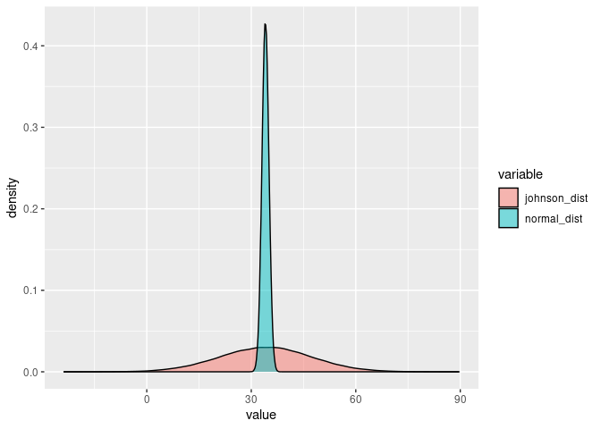

Johnson Distribution
================

``` r
polls <- read.csv(here::here("Data" , "senate_polls.csv")) #loading data
polls <- georgia::initial_poll_cleaning(polls) #cleaning via the georgia package
```

# Johnson vs Normal

The first thing to consider after the initial EDA are priors into how
election data might be structured. Based on knowledge of the American
Electoral it might be reasonable to look into a distribution that has
“fat” tails. The reasoning behind this is because of the fact that the
American electorate is rather partisan, so a lot of the votes do not
have much variability. In order to address this the first step I
considered modeling the data off of the Johnson Distribution instead of
a Normal Distribution, due to its bigger tails.

``` r
n <- 100000
parmamter_data <- polls %>% 
  group_by(candidate_name) %>%
  select(candidate_name, pct) %>%
  filter(candidate_name == "David A. Perdue" | candidate_name == "Jon Ossoff")

paramters <- JohnsonFit(parmamter_data$pct) #This is from the SuppDists package
                                            #finding parameter values for the next line of code

#rJohnson is similar to base are functions like rnorm or runif                  
johnson_dist <- rJohnson(n = n, 
                         parms = list(gamma = 0.39, 
                                      delta = 1.09, 
                                      xi = 39.19,
                                      lambda = 14.4, 
                                      type = "SN"))

normal_dist <- rnorm(n = n, mean = mean(johnson_dist), sd = 1)

overlay <- melt(as.data.frame(cbind(johnson_dist, normal_dist)))

ggplot(overlay, aes(value, fill = variable)) +
  geom_density(alpha = 0.5)
```

<!-- -->

``` r
#fat tails!
```
