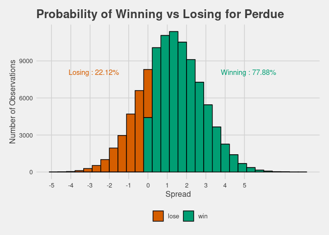
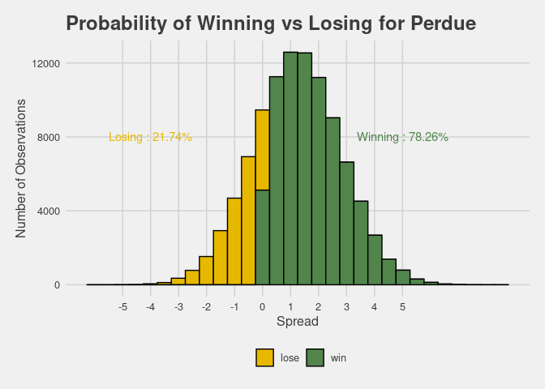

03\_candidate\_probabilities
================

``` r
boot_data <- read.csv(here::here("Data", "bootData.csv"))

boot_spread <- map(1:10000, ~sample(boot_data$actual_spread, size = length(boot_data), replace = TRUE)) %>%
  map_dbl(mean)

boot_spread <- melt(boot_spread)
```

``` r
fit <- MASS:: fitdistr(boot_spread$value, "normal")
```

``` r
## Set up for computing the distributions of spreads in regards to jon ossoff

n <- 100000

empty_vec <- rep((boot_data %>%
                    group_by(candidate_name) %>%
                    summarise(average_spread = mean(actual_spread)) %>%
                    filter(candidate_name == "David A. Perdue") %>%
                    select(average_spread)), n) %>%
                    flatten_dbl()
```

    ## `summarise()` ungrouping output (override with `.groups` argument)

``` r
#This is where the actual predictions are now taking place

Perdue <- (as.numeric(fit$estimate[2]) * rnorm(n, as.numeric(fit$estimate[1]), 
                                                     as.numeric(fit$estimate[2]))) + empty_vec 
```

``` r
# in terms of ossof
empty_vec_ossof <- rep((boot_data %>%
                    group_by(candidate_name) %>%
                    summarise(average_spread = mean(actual_spread)) %>%
                    filter(candidate_name == "Jon Ossoff") %>%
                    select(average_spread)), n) %>%
                    flatten_dbl()
```

    ## `summarise()` ungrouping output (override with `.groups` argument)

``` r
#This is where the actual predictions are now taking place

Ossof <- (as.numeric(fit$estimate[2]) * rnorm(n, as.numeric(fit$estimate[1]), 
                                                     as.numeric(fit$estimate[2]))) + empty_vec_ossof 
```

``` r
combined_probs <- melt(as.data.frame(cbind(Perdue, Ossof)))
```

    ## No id variables; using all as measure variables

``` r
combined_probs <- combined_probs %>% 
  group_by(variable) %>%
  mutate_at(vars(variable), as.character) %>%
  mutate(wining_color = case_when((variable == "Perdue" & value > 0) ~ "win",
                                   (variable == "Perdue" & value < 0) ~ "lose",
                                   (variable == "Ossof" & value > 0) ~ "win",
                                   (variable == "Ossof" & value < 0) ~ "lose"))
  #mutate(color_perdue = ifelse(value > 0, "red", "blue")) %>%
  #mutate(color_ossof = ifelse(variable 0 & value > 0, "blue", "red"))
combined_probs <- combined_probs %>%
  mutate(prob_winning = case_when((variable == "Perdue" & 
                                    wining_color == "win" ~ 
                                    length(which(Perdue > 0)) / n),
                                  (variable == "Perdue" & 
                                    wining_color == "lose" ~ 
                                    length(which(Perdue < 0)) / n),
                                  (variable == "Ossof" & 
                                    wining_color == "win" ~ 
                                    length(which(Ossof > 0)) / n),
                                  (variable == "Ossof" & 
                                    wining_color == "lose" ~ 
                                    length(which(Ossof < 0)) / n)))
```

``` r
probability_winning_plot <- function(candidate){
ggplot((combined_probs %>% filter(variable == sprintf(candidate))), aes(value)) +
  geom_histogram(aes(fill = wining_color), color = "black", bins = 30) +
  ggthemes::theme_fivethirtyeight() +
  theme(axis.title = element_text()) + xlab("Spread") + ylab("Number of Observations") +
  theme(legend.title = element_blank()) +
  scale_x_continuous(breaks = c(-5:5)) +
  labs(title = sprintf("Probability of Winning vs Losing for %s", candidate)) +
  annotate(geom = "text", x = 5, y = 8000, 
           label = sprintf("Winning : %s", 
                           combined_probs %>% 
                             filter(wining_color == "win" & variable == candidate) %>% 
                             summarise(label_percent(accuracy = 0.01)(mean(prob_winning))) %>% 
                             select(-variable) %>% flatten_chr()),
           color = "#00BFC4") +
  annotate(geom = "text", x = -5, y = 8000, label = sprintf("Losing : %s", 
                           combined_probs %>% 
                             filter(wining_color == "lose" & variable == candidate) %>% 
                             summarise(label_percent(accuracy = 0.01)(mean(prob_winning))) %>% 
                             select(-variable) %>% flatten_chr()), 
           color = "#F8766D")
}
probability_winning_plot("Perdue")
```

    ## `summarise()` ungrouping output (override with `.groups` argument)
    ## `summarise()` ungrouping output (override with `.groups` argument)

<!-- -->

``` r
probability_winning_plot("Ossof")
```

    ## `summarise()` ungrouping output (override with `.groups` argument)
    ## `summarise()` ungrouping output (override with `.groups` argument)

<!-- -->
