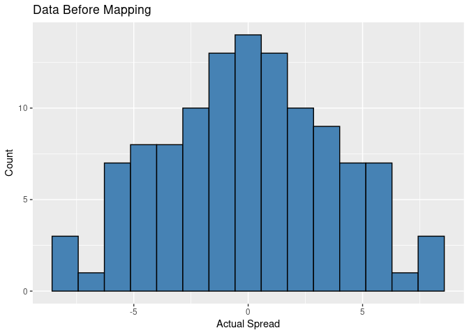
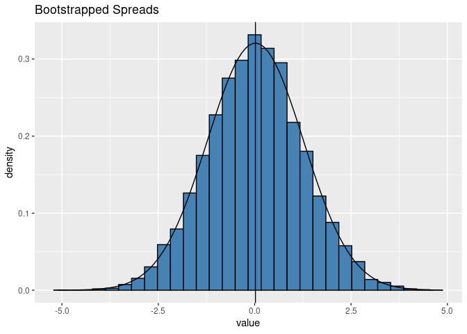
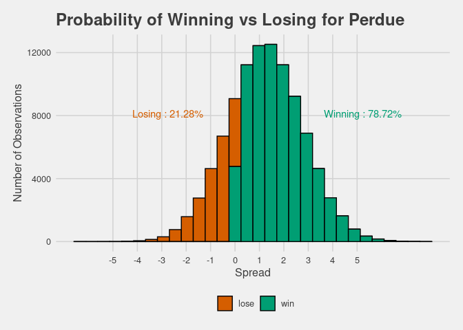
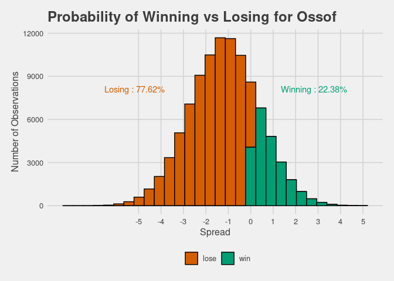

03\_candidate\_probabilities
================

Originally in file `01_Johnson_Distribution` I thought it would be wise
to have a distribution with wider tails. The issue with this approach is
that I would be applying a distribution, in this case the Johnson, with
no really mathematical reason, just my own priors. So instead, I decided
to bootstrap my polling data in order to achieve
normality.

``` r
boot_data <- read.csv(here::here("Data", "bootData.csv")) #load in the dataset formated for bootstrapping

#following code performs the bootstrap
boot_spread <- map(1:10000, ~sample(boot_data$actual_spread, 
                                    size = length(boot_data), replace = TRUE)) %>%
  map_dbl(mean)

boot_spread <- melt(boot_spread)
boot_spread %>% head()
```

    ##        value
    ## 1  1.2777778
    ## 2 -1.7933333
    ## 3 -0.1155556
    ## 4  0.5644444
    ## 5 -2.0000000
    ## 6 -0.7111111

``` r
ggplot(boot_data, aes(actual_spread)) +
  geom_histogram(bins = 15,  fill = "steelblue", color = "black") +
  xlab("Actual Spread") +
  ylab("Count") +
  ggtitle("Data Before Mapping")
```

<!-- -->

``` r
#Looking pretty normal!
ggplot(boot_spread, aes(value)) +
  geom_histogram(aes(y=..density..), fill = "steelblue", color = "black") +
  stat_function(fun = dnorm, args = c(mean = mean(boot_spread$value), sd = sd(boot_spread$value))) +
  geom_vline(xintercept = mean(boot_spread$value)) +
  labs(title = "Bootstrapped Spreads")
```

<!-- -->

``` r
fit <- fitdistr(boot_spread$value, "normal") #finding the paramter values
```

``` r
## Set up for computing the distributions of spreads in regards to Perdue
n <- 100000

empty_vec <- rep((boot_data %>%
                    group_by(candidate_name) %>%
                    summarise(average_spread = mean(actual_spread)) %>%
                    filter(candidate_name == "David A. Perdue") %>%
                    dplyr::select(average_spread)), n) %>%
                    flatten_dbl()

#This is where the actual predictions are now taking place
Perdue <- (as.numeric(fit$estimate[2]) * rnorm(n, as.numeric(fit$estimate[1]), 
                                                     as.numeric(fit$estimate[2]))) + empty_vec 
```

``` r
# in terms of ossof
empty_vec_ossof <- rep((boot_data %>%
                    group_by(candidate_name) %>%
                    summarise(average_spread = mean(actual_spread)) %>%
                    filter(candidate_name == "Jon Ossoff") %>%
                    dplyr::select(average_spread)), n) %>%
                    flatten_dbl()

#This is where the actual predictions are now taking place
Ossof <- (as.numeric(fit$estimate[2]) * rnorm(n, as.numeric(fit$estimate[1]), 
                                                     as.numeric(fit$estimate[2]))) + empty_vec_ossof 
```

``` r
combined_probs <- melt(as.data.frame(cbind(Perdue, Ossof))) #making the data ggplot friendly 
                                                            #by using the reshape pacakge
combined_probs <- georgia::probability_dataset(combined_probs)
```

Finally the next two lines of code are using a function in the georgia
package to create probabilities of winning and losing for each
candidate.

``` r
probability_winning_plot("Perdue")
```

<!-- -->

``` r
probability_winning_plot("Ossof")
```

<!-- -->
