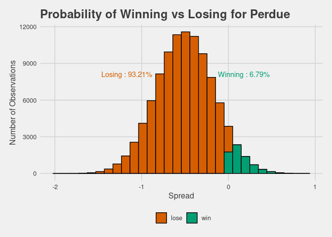

Fake Data Code
================

``` r
polls <- read.csv(here::here("Data" , "senate_polls.csv"))
polls <- georgia::initial_poll_cleaning(polls)
```

In order to see if the simulation done in
`03_candidate_probabilities.Rmd` actually works I made the following
function that take in a uniform distributions and checks different
bounds in order to see if the resulting candidate probabilities are
reasonable given those bounds. The bounds here are representing the min
and max
spread.

``` r
fake_polling <- function(distribution, size, min_spread, max_spread, candidate) {

#Creating the fake data

fake_polls <- polls %>% 
  group_by(candidate_name, candidate_party, cycle) %>%
  filter(candidate_name == "David A. Perdue" | candidate_name == "Jon Ossoff")

fake_polls <- fake_polls %>%
  mutate(candidate_party = recode(candidate_party, 
                                  `REP` = "R", 
                                  `DEM` = "D")) %>%
  filter(candidate_party == "R" | candidate_party == "D") %>% 
  group_by(question_id) %>%
  dplyr::select(question_id, poll_id, fte_grade, sample_size, candidate_name, candidate_party, pct) %>%
  filter(question_id != 123442 & question_id != 123443) %>%
  mutate(spread = pct - pct[candidate_party == "D"]) %>%
  mutate(spread2 = pct - pct[candidate_party == "R"]) %>%
  mutate(fake_spread = spread + spread2) %>%
  dplyr::select(-spread, -spread2)


fake_polls <- as.data.frame(round(distribution(size, min = min_spread, max = max_spread), 1))
colnames(fake_polls) <- "fake_spread"
fake_polls <- fake_polls %>%
  slice(rep(1:n(), each = 2)) %>%
  mutate(ID = row_number()) %>%
  mutate(candidate_name = case_when((ID %% 2 == 0) ~ "David A. Perdue",
                                    (ID %% 2 != 0) ~ "Jon Ossoff")) %>%
  mutate(fake_spread = case_when((ID %% 2 == 0) ~ fake_spread,
                                 (ID %% 2 != 0) ~ fake_spread * -1))

fake_boot_spread <- map(1:size, ~sample(fake_polls$fake_spread, 
                                        size = length(fake_polls), 
                                        replace = TRUE)) %>%
  map_dbl(mean)

fake_boot_spread <- melt(fake_boot_spread)

reps <- size

empty_vec <- rep((fake_polls %>%
                    group_by(candidate_name) %>%
                    summarise(average_spread = mean(fake_spread)) %>%
                    filter(candidate_name == "David A. Perdue") %>%
                    dplyr::select(average_spread)), reps) %>%
                    flatten_dbl()

fake_boot_spread <- fake_boot_spread %>% flatten_dbl()

Perdue <- (sd(fake_boot_spread) * rnorm(size, mean(fake_boot_spread), 
                                                     sd(fake_boot_spread))) + empty_vec 

empty_vec_ossof <- rep((fake_polls %>%
                    group_by(candidate_name) %>%
                    summarise(average_spread = mean(fake_spread)) %>%
                    filter(candidate_name == "Jon Ossoff") %>%
                    dplyr::select(average_spread)), reps) %>%
                    flatten_dbl()

Ossof <- (sd(fake_boot_spread) * rnorm(size, mean(fake_boot_spread), 
                                                     sd(fake_boot_spread))) + empty_vec_ossof 


combined_probs <- melt(as.data.frame(cbind(Perdue, Ossof)))
combined_probs <- combined_probs %>% 
  group_by(variable) %>%
  mutate_at(vars(variable), as.character) %>%
  mutate(wining_color = case_when((variable == "Perdue" & value > 0) ~ "win",
                                   (variable == "Perdue" & value < 0) ~ "lose",
                                   (variable == "Ossof" & value > 0) ~ "win",
                                   (variable == "Ossof" & value < 0) ~ "lose"))

combined_probs <- combined_probs %>%
  mutate(prob_winning = case_when((variable == "Perdue" & 
                                    wining_color == "win" ~ 
                                    length(which(Perdue > 0)) / size),
                                  (variable == "Perdue" & 
                                    wining_color == "lose" ~ 
                                    length(which(Perdue < 0)) / size),
                                  (variable == "Ossof" & 
                                    wining_color == "win" ~ 
                                    length(which(Ossof > 0)) / size),
                                  (variable == "Ossof" & 
                                    wining_color == "lose" ~ 
                                    length(which(Ossof < 0)) / size)))


fake_probs_plot <- ggplot((combined_probs %>% 
                             filter(variable == sprintf(candidate))), 
                          aes(value)) +
  geom_histogram(aes(fill = wining_color), color = "black", bins = 30) +
  ggthemes::theme_fivethirtyeight() +
  theme(axis.title = element_text()) + xlab("Spread") + ylab("Number of Observations") +
  theme(legend.title = element_blank()) +
  scale_x_continuous(breaks = seq((-1 * ceiling(max(combined_probs$value))) , 
                                  (ceiling((max(combined_probs$value)))) , by = 1)) +
  labs(title = sprintf("Probability of Winning vs Losing for %s", candidate)) +
  scale_fill_manual(values = c("#D55E00", "#009E73")) +
  annotate(geom = "text", x = (as.numeric(combined_probs %>% 
                                           filter(variable == candidate) %>% 
                                           summarise(average = mean(value)) %>% 
                                           flatten_chr())[2]) + .75 * (as.numeric(combined_probs %>% 
                                                                              filter(variable == "Perdue") %>% 
                                                                              summarise(max = max(value)) %>% 
                                                                              flatten_chr())[2]), 
                          y = 8100, 
           label = sprintf("Winning : %s", 
                           combined_probs %>% 
                             filter(wining_color == "win" & variable == candidate) %>% 
                             summarise(label_percent(accuracy = 0.01)(mean(prob_winning))) %>% 
                             dplyr::select(-variable) %>% flatten_chr()),
           color = "#009E73") +
  annotate(geom = "text", x = (as.numeric(combined_probs %>% 
                                           filter(variable == candidate) %>% 
                                           summarise(average = mean(value)) %>% 
                                           flatten_chr())[2]) - 0.75 * (as.numeric(combined_probs %>% 
                                                                              filter(variable == "Perdue") %>% 
                                                                              summarise(max = max(value)) %>% 
                                                                              flatten_chr())[2]),
                          y = 8100, 
           label = sprintf("Losing : %s", 
                           combined_probs %>% 
                             filter(wining_color == "lose" & variable == candidate) %>% 
                             summarise(label_percent(accuracy = 0.01)(mean(prob_winning))) %>% 
                             dplyr::select(-variable) %>% flatten_chr()), 
           color = "#D55E00")

return(fake_probs_plot)
}
```

The following graph has a lower and upper bound equally far from zero so
the probability should be fifty-fifty. Whereas the second graph’s
underlining distribution has more of polls negative for Perdue meaning
that he should be losing by a significant amount. Ultimately this is
what happens in both cases so this indicates that the simulation in
`03_candidate_probabilities.Rmd` is doing a pretty good job.

``` r
fake_polling(distribution = runif, size = 100000, min_spread = -4, 
             max_spread = 4, candidate = "Perdue")
```

<!-- -->

``` r
fake_polling(distribution = runif, size = 100000, min_spread = -2, 
             max_spread = 1, candidate = "Perdue")
```

<!-- -->
