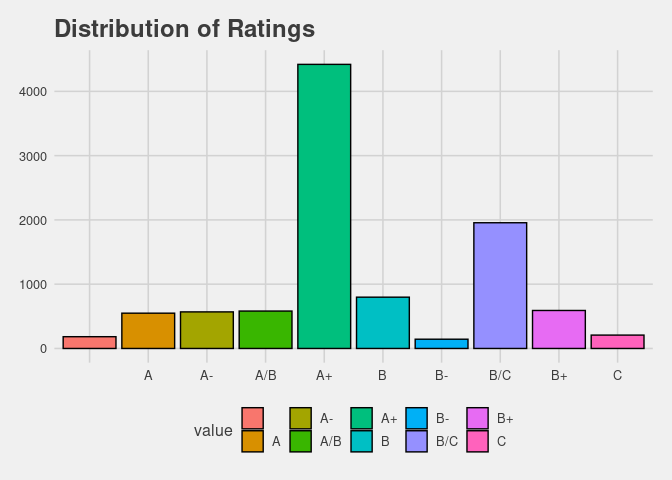
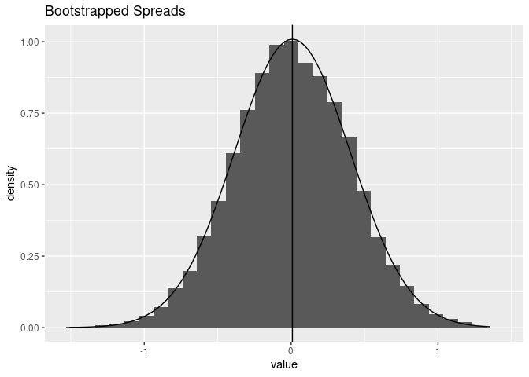

Weight Polling
================

``` r
polls <- read.csv(here::here("Data" , "senate_polls.csv"))
polls <- georgia::initial_poll_cleaning(polls)
```

# Bootstrapping with Weights

``` r
boot_data <- read.csv(here::here("Data", "bootData.csv"))
boot_spread <- map(1:10000, ~sample(boot_data$actual_spread, size = length(boot_data), replace = TRUE)) %>%
  map_dbl(mean)

boot_spread <- melt(boot_spread)
```

``` r
boot_data_weights <- boot_data %>% group_by(fte_grade) %>%
                  mutate(Weights = case_when(fte_grade == "A+" ~ .2,
                             fte_grade == "A" ~ .15,
                             fte_grade == "A-" ~ .15,
                             fte_grade == "A/B" ~ .1,
                             fte_grade == "B+" ~ .1,
                             fte_grade == "B" ~ .05,
                             fte_grade == "B/C" ~ .05,
                             fte_grade == "C+" ~ .05,
                             fte_grade == "C" ~ .05,
                             fte_grade == "C/D" ~ .05,
                             fte_grade == "No Rating" ~ .025)) %>%
                  replace(is.na(.), 0.025) %>%
                  group_by(Weights)

check <- sample(boot_data_weights$fte_grade, size = 10000, replace = TRUE, prob = boot_data_weights$Weights)
check <- reshape2::melt(check)
check <- check %>%
  count(value)

ggplot(check, aes(value, n)) +
  geom_bar(stat = "identity")
```

<!-- -->

``` r
#looks like a good distribution
```

``` r
boot_data_weights %>% filter(candidate_name == "Jon Ossoff") %>% summarise(fjdklas = weighted.mean(actual_spread, (Weights)))
```

    ## `summarise()` ungrouping output (override with `.groups` argument)

    ## # A tibble: 5 x 2
    ##   Weights fjdklas
    ##     <dbl>   <dbl>
    ## 1   0.025   1.14 
    ## 2   0.05   -0.961
    ## 3   0.1    -0.150
    ## 4   0.15   -2.65 
    ## 5   0.2    -3.36

``` r
weighted.mean(boot_data_weights$actual_spread, boot_data_weights$Weights)
```

    ## [1] 0

``` r
with(boot_data_weights, weighted.mean(boot_data_weights$actual_spread, boot_data_weights$Weights))
```

    ## [1] 0

``` r
boot_spread_weights <- map(1:10000, ~sample(boot_data$actual_spread, size = length(boot_data$actual_spread), replace = TRUE, prob = boot_data_weights$Weights)) %>%
  map_dbl(mean)

boot_spread_weights <- melt(boot_spread_weights)
ggplot(boot_spread_weights, aes(value)) +
  geom_histogram(aes(y=..density..)) +
  stat_function(fun = dnorm, args = c(mean = mean(boot_spread_weights$value), sd = sd(boot_spread_weights$value))) +
  geom_vline(xintercept = mean(boot_spread_weights$value)) +
  labs(title = "Bootstrapped Spreads")
```

    ## `stat_bin()` using `bins = 30`. Pick better value with `binwidth`.

<!-- -->

``` r
fit <- MASS:: fitdistr(boot_spread_weights$value, "normal")
  
n <- 100000

empty_vec <- rep((boot_data_weights %>%
                    group_by(fte_grade) %>%
                    filter(candidate_name == "David A. Perdue") %>%
                    summarise(average_spread = weighted.mean(actual_spread, Weights)) %>%
                    
                    select(average_spread)), n) %>%
  flatten_dbl()
```

    ## `summarise()` ungrouping output (override with `.groups` argument)

``` r
boot_spread_weights <- boot_spread_weights %>% flatten_dbl()

#This is where the actual predictions are now taking place

Perdue <- (sd(boot_spread_weights) * rnorm(n, mean(boot_spread_weights), 
                                                     sd(boot_spread_weights))) + empty_vec 

# in terms of ossof
empty_vec_ossof <- rep((boot_data_weights %>%
                          group_by(fte_grade) %>%
                          filter(candidate_name == "Jon Ossoff") %>%
                          summarise(average_spread = weighted.mean(actual_spread, Weights)) %>%
                          
                          select(average_spread)), n) %>%
  flatten_dbl()
```

    ## `summarise()` ungrouping output (override with `.groups` argument)

``` r
#This is where the actual predictions are now taking place


Ossof <- (sd(boot_spread_weights) * rnorm(n, mean(boot_spread_weights), 
                                                     sd(boot_spread_weights))) + empty_vec_ossof 


combined_probs <- melt(as.data.frame(cbind(Perdue, Ossof)))
```

    ## No id variables; using all as measure variables

``` r
combined_probs <- combined_probs %>% 
  group_by(variable) %>%
  mutate_at(vars(variable), as.character) %>%
  mutate(wining_color = case_when((variable == "Perdue" & value > 0) ~ "win",
                                  (variable == "Perdue" & value < 0) ~ "lose",
                                  (variable == "Ossof" & value > 0) ~ "win",
                                  (variable == "Ossof" & value < 0) ~ "lose"))
n <- 1000000

combined_probs <- combined_probs %>%
  mutate(prob_winning = case_when((variable == "Perdue" & 
                                     wining_color == "win" ~ 
                                     length(which(Perdue > 0)) / n),
                                  (variable == "Perdue" & 
                                     wining_color == "lose" ~ 
                                     length(which(Perdue < 0)) / n),
                                  (variable == "Ossof" & 
                                     wining_color == "win" ~ 
                                     length(which(Ossof > 0)) / n),
                                  (variable == "Ossof" & 
                                     wining_color == "lose" ~ 
                                     length(which(Ossof < 0)) / n)))
```

``` r
georgia::probability_winning_plot("Perdue")
```

    ## Warning in vapply(x, is.null, logical(1)): NAs introduced by coercion
    
    ## Warning in vapply(x, is.null, logical(1)): NAs introduced by coercion

<!-- -->
